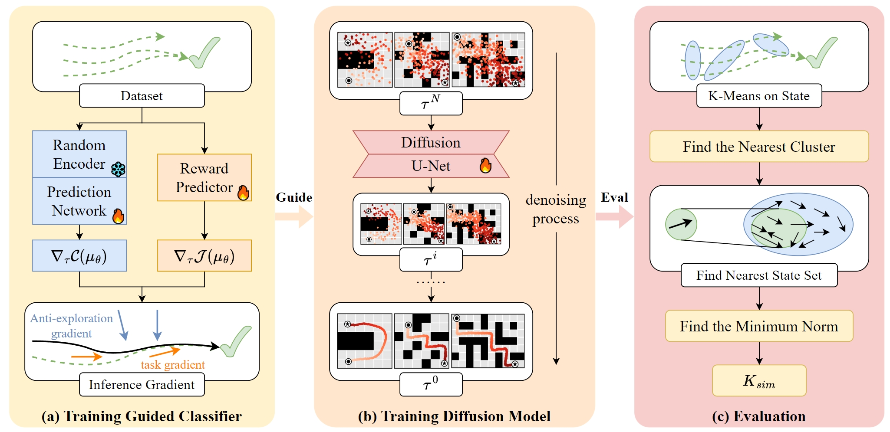

<!-- Improved compatibility of back to top link: See: https://github.com/othneildrew/Best-README-Template/pull/73 -->
<a name="readme-top"></a>
<!--
*** Thanks for checking out the Best-README-Template. If you have a suggestion
*** that would make this better, please fork the repo and create a pull request
*** or simply open an issue with the tag "enhancement".
*** Don't forget to give the project a star!
*** Thanks again! Now go create something AMAZING! :D
-->

<!-- <p align="center">
    <br>
    
    <br>
<p> -->

# 🐜 Curiosity-Diffuser: Curiosity Guide Diffusion Models for Reliability

<p align="center">
·
<a href="https://arxiv.org/abs/2406.09509">ArXiv</a>
·
</p>

Curiosity-Diffuser is an novel guided diffusion model with anti-curiosity for decision making, thereby improving the reliability of the policy. The core idea is to use a Random Network Distillation (RND) curiosity module to assess whether the model's behavior aligns with the training data, and then minimize curiosity by classifier guidance diffusion to reduce overgeneralization during inference. Additionally, we propose a computationally efficient metric for evaluating the reliability of the policy, measuring the similarity between the generated behaviors and the training dataset, to facilitate research about reliability learning.


<p align="center">
    <br>
    
    <br>
<p>

<!-- GETTING STARTED -->
## 🛠️ Getting Started

#### 1. Create and activate conda environment
```bash
$ conda create -n cleandiffuser python==3.9
$ conda activate cleandiffuser
```
#### 2. Install PyTorch
Install `torch>1.0.0,<2.3.0` that is compatible with your CUDA version. For example, `PyTorch 2.2.2` with `CUDA 12.1`:
```bash
$ conda install pytorch==2.2.2 torchvision==0.17.2 pytorch-cuda=12.1 -c pytorch -c nvidia
```
#### 3. Install CleanDiffuser from source
```bash
$ git clone https://github.com/CleanDiffuserTeam/CleanDiffuser.git
$ cd CleanDiffuser
$ pip install -e .
```
#### 4. Additional installations
For users who need to run `pipelines` and reproduce the results of the paper, they will need to install RL simulators.

First, install the dependencies related to the mujoco-py environment. For more details, see https://github.com/openai/mujoco-py#install-mujoco

```bash
$ sudo apt-get install libosmesa6-dev libgl1-mesa-glx libglfw3 libglew-dev patchelf
```
```bash
# Install D4RL from source (recommended)
$ cd <PATH_TO_D4RL_INSTALL_DIR>
$ git clone https://github.com/Farama-Foundation/D4RL.git
$ cd D4RL
$ pip install -e .
```

Then use pipelines to reproduce the results of the paper.
```bash
# train diffusion model and reward classifier
$ python pipelines/diffuser_d4rl_mujoco.py # task=halfcheetah-medium-expert-v2 or change code to other tasks
$ python pipelines/diffuser_d4rl_antmaze.py

#train rnd classifier
$ python pipelines/diffuser_rnd_d4rl_mujoco.py
$ python pipelines/diffuser_rnd_d4rl_antmaze.py
```

For test, move the diffusion model and reward classifier to the rnd folder, like following:

```bash
result/diffuser_d4rl_mujoco_rnd/halfcheetah-medium-expert-v2
.
├── rnd_classifier/
├────classifier_ckpt_latest.pt # rnd classifier
├────rnd_classifier_target.pt # rnd target net
├── diffusion_ckpt_latest.pt # diffusion model
├── classifier_ckpt_latest.pt # reward classifier
```
Then use the following command to test:
```bash
$ python pipelines/diffuser_d4rl_mujoco_diffusiontest.py
$ python pipelines/diffuser_d4rl_antmaze_diffusiontest.py
```


**KEY POINT: the coefficient of rnd need to be set in `cleandiffuser/classifier/rnd_classifier.py`. In AntMaze Env, the coefficient is set to 10\~100. In halfcheetah, the coefficient is set to 1e4\~1e5. In hopper and walker, the coefficient is set to 1e3\~1e4. This is dependent on the reward scale setting.**


<!-- CONTACT -->
## ✉️ Contact

For any questions, please feel free to email `liuzihao@mail.nwpu.edu.cn`.

<!-- CITATION -->
## 📝 Citation

If you find our work useful, please consider citing:
```
xxx
```
